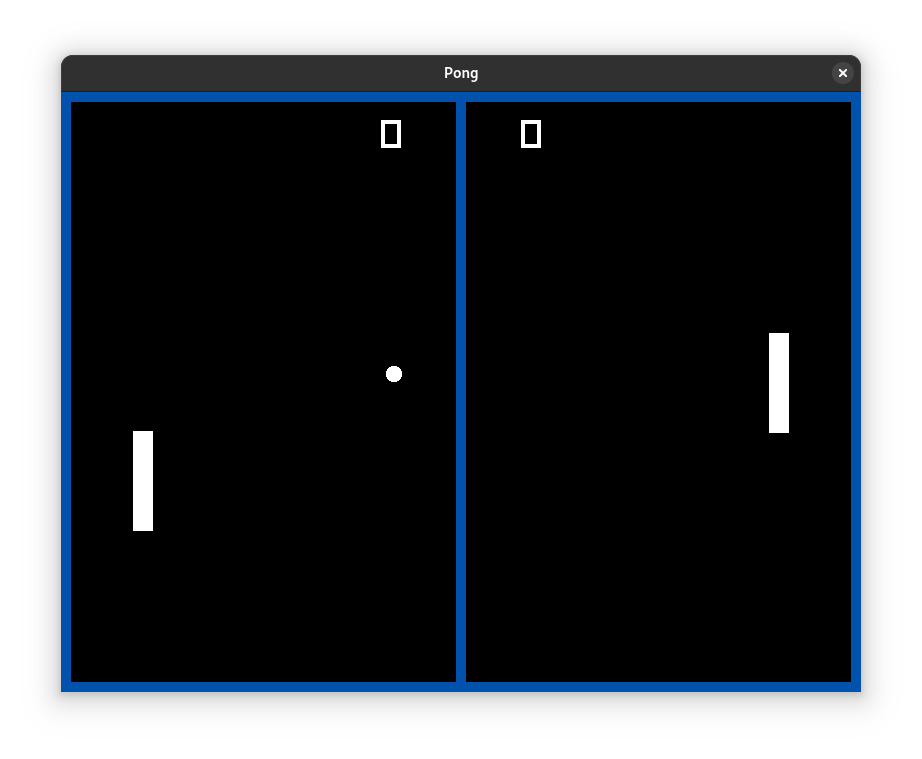
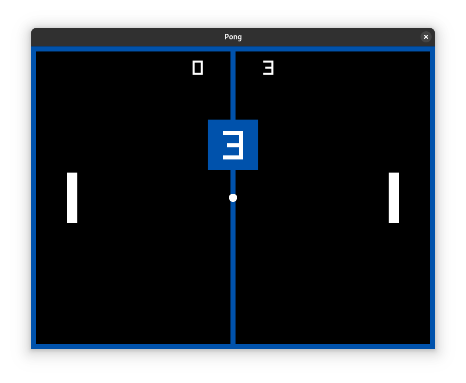

# Pong
<div align="center">
  
  
</div>

## Description
This is a Pong game made with C++ and Raylib. The project is currently under development.

### Warning
This project is being developed on Linux. It can run on Windows, but may require some extra setup.

## Requirements
- Raylib
- GCC
- C++20

## How to Run
```bash
make run
```

## Tools & Technologies Used
- **Raylib** – for graphics and game loop
- **C++20** – modern C++ features
- **GCC** - for compile this project
- **Clang** – for analysis and tooling
- **Clang-tidy** – linter and static analyzer
- **Clangd** – LSP for C++, installed via [Mason](https://github.com/williamboman/mason.nvim)
  - `.clangd` – config file to specify C++ version and settings for the LSP
- **clang-format** – code formatter, also installed via Mason
  - `.clang-format` – auto-generated config file that defines formatting rules
- **Bear** – generates `compile_commands.json` for Clang tooling
- **Neovim** – used as the code editor
